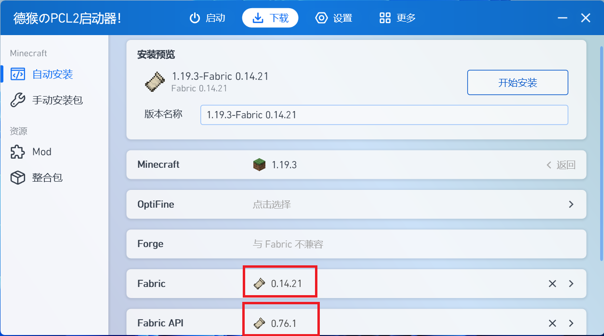
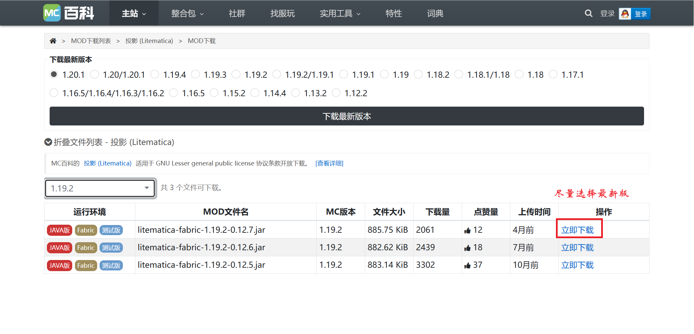
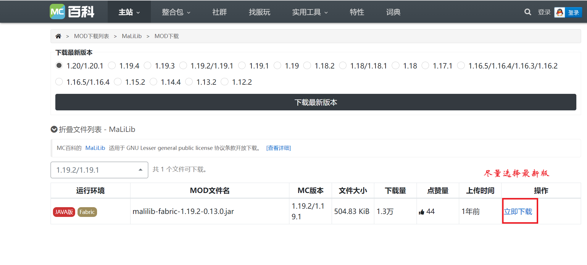
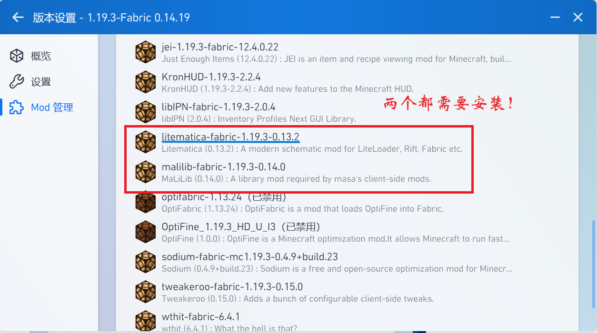
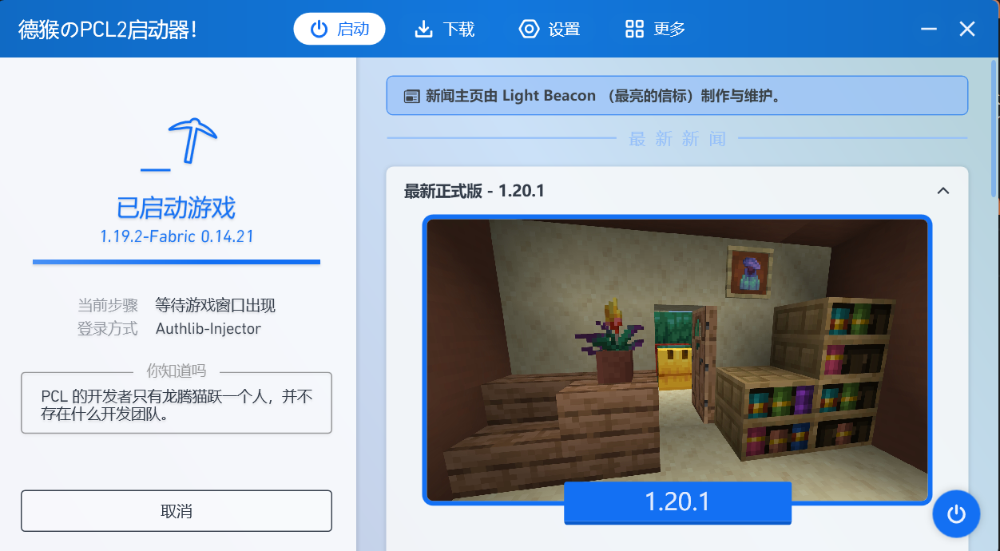

# 如何在MC中安装并使用投影

## 一、安装投影

### 1.安装含有Fabric的MC

打开你的PCL2，

点击下载，选择一个喜欢的版本，点击并进入安装界面。按照下图配置↓

点击安装。

### 2.下载投影模组

打开[McMod下载站1](https://www.mcmod.cn/download/2261.html)和[McMod下载站2](https://www.mcmod.cn/download/2298.html)（两个都需要），下载对应的版本。

### 3.安装投影模组

安装完成后，点击版本设置，点击Mod设置，把下载进来的投影模组安装进mc。

启动游戏。

## 二、加载投影

在PCL2上点击“版本设置”，点击“版本文件夹”。

在打开的文件夹中，打开名叫“schematics”的文件夹，把投影放入里面，即可。

