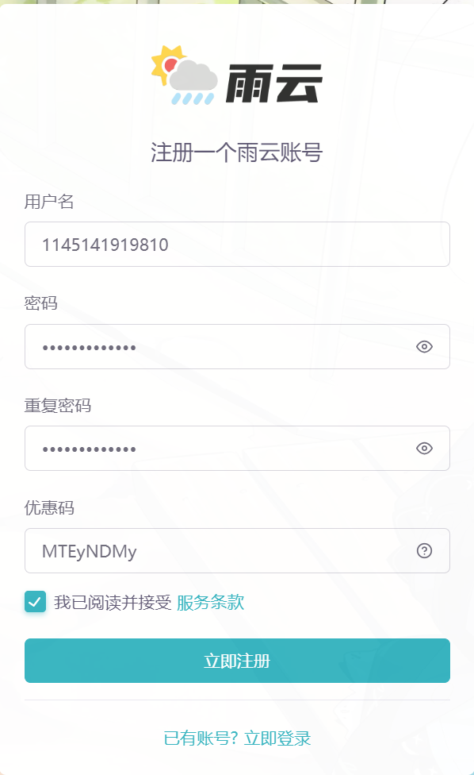
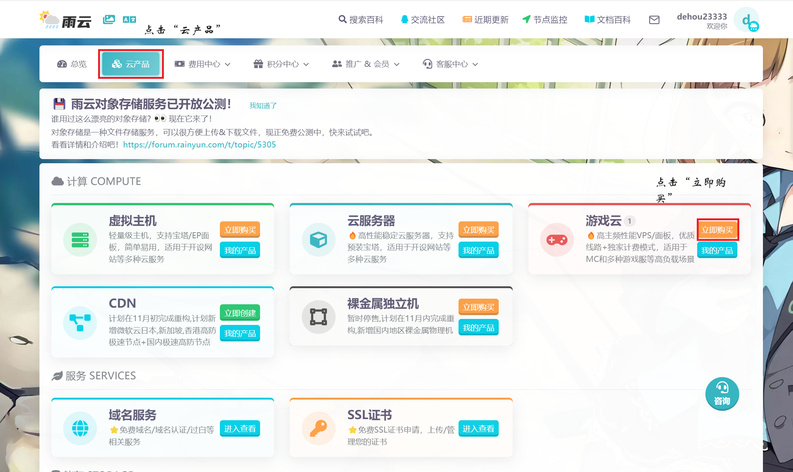

# 入手雨云

## 1.注册账号

打开[官网](https://www.rainyun.com/MTEyNDMy_)(如果不使用链接注册，可输入优惠码MTEyNDMy)，点击“注册”，自行设置用户名，密码。完成后勾选服务条款，点击“注册”，完成注册。

## 2.创建服务器

登陆账号，点击“云产品”，购买产品。

建议选择“自定义”，点击“继续”。

选择“Java”，点击“继续”。

选择“Java多版本镜像”，点击“继续”。

一定要选择50积分/天的配置，其他的配置需要额外充钱，点击“继续”。

直接点击“确认创建”。

等待服务器创建完成。

## 3.配置服务器

选择服务端，具体请查看[这篇文章]()
